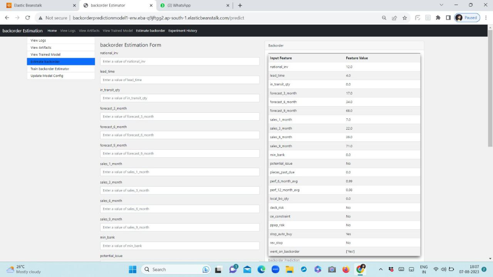

# backorder_prediction_Project
# Overview
This project aims to predict the likelihood of backorders for products in a supply chain using machine learning techniques. Backorders occur when a product is temporarily out of stock, and customers need to wait for it to become available again. By predicting potential backorders, businesses can proactively manage their inventory and improve customer satisfaction.

## Project Demo Video Link :
(Screenshots/Backorder Prediction.mp4)


# AWS Deployment Link :

AWS Elastic Beanstalk link : [[http://backorderpredictionmodel1-env.eba-q9jftgg2.ap-south-1.elasticbeanstalk.com/]](http://backorderpredictionmodel1-env.eba-q9jftgg2.ap-south-1.elasticbeanstalk.com/)

# Screenshot of UI




## Variables
#### sku - sku code
#### national_inv - Current inventory level of component
#### lead_time - Transit time
#### in_transit_qtry - Quantity in transit
#### forecast_x_month - Forecast sales for the net 3, 6, 9 months
#### sales_x_month - Sales quantity for the prior 1, 3, 6, 9 months
#### min_bank - Minimum recommended amount in stock
#### potential_issue - Indictor variable noting potential issue with item
#### pieces_past_due - Parts overdue from source
#### perf_x_months_avg - Source performance in the last 6 and 12 months
#### local_bo_qty - Amount of stock orders overdue
#### X17-X22 - General Risk Flags
#### went_on_back_order - Product went on backorder

## Dataset
```bash
https://github.com/AkshayNikam123/internship_backorder_prediction_project/raw/main/backorderdata.csv.gz


## Installation Procedure:

1.Create a New Conda Environment:
   ```bash
   conda create -p venv python=3.11 -y

2. Activate the Conda Environment:
   ```bash
   conda activate venv/
   ```


3. upgrade pip:
   ```bash
   python -m pip install --upgrade pip
   ```

   
4. Install build package:
   ```bash
   python -m pip install --upgrade build
   ```

5. Install the Required Packages from setup.py
   ```bash
   python -m build


6. This command will output a lot of text and once completed should generate two files in the dist directory:
   ```bash
   dist/
   ├── example_package_YOUR_USERNAME_HERE-0.0.1-py3-none-any.whl
   └── example_package_YOUR_USERNAME_HERE-0.0.1.tar.gz
   
7. Install the Distribution File:
   ```bash
   python -m pip install dist/example_package_YOUR_USERNAME_HERE-0.0.1-py3-none-any.whl

## Usage 
1. Main project folder         : /
2. Flask web page application  : /app.py
   ```bash
   python application.py
3. To train ml pipeline/model  : /pipeline.py
   ```bash
   python pipeline.py

## Configuration
Three main config files are present in /config folder.
1. config.yaml : It contains all the project related config details
2. model.yaml : It contains all model training related details. Change parameters in this file to perform hyperparameter tuning.
3. schema.yaml : It contains schema of the dataset for validation purpose.


## Project Structure
```bash

Backorder-Prediction/
│
├── .gitignore
├── LICENSE
├── setup.py
├── README.md
├── application.py
├── pipeline.py
├── requirements.txt
├── .ebextensions/
│   └── python.config
├── config/
│   ├── config.yaml
│   ├── model.yaml
│   └── schema.yaml
├── notebook/
│   └── ... (Jupyter notebooks)
├── saved_models/
│   └── ... (saved models)
├── templates/
│   └── ... (HTML templates for the web app)
├── Documents/
│   ├── High Level Design.pdf
│   ├── Low Level Design.pdf
│   └── Wireframe.pdf
└── backorder/
    ├── components/
    │   ├── __init__.py
    │   ├── data_ingestion.py
    │   ├── data_validation.py
    │   ├── data_transformation.py
    │   ├── model_trainer.py
    │   ├── model_evaluation.py
    │   └── model_pusher.py
    ├── config/
    │   ├── __init__.py
    │   └── configuration.py
    ├── constant/
    │   ├── __init__.py
    ├── entity/
    │   ├── __init__.py
    │   ├── artifact_entity.py
    │   ├── config_entity.py
    │   ├── model_factory.py
    │   └── predictor.py
    ├── pipeline/
    │   ├── __init__.py
    │   └── pipeline.py
    ├── __init__.py
    ├── exception.py
    ├── logger.py

```
## Project Structure


## Methodology
The project follows a comprehensive approach that involves data preprocessing, feature selection, model training, and evaluation. It employs machine learning algorithms such as Logistic Regression, Random Forest,Decision Tree,SVC.


## Features

* On one click or command, program will start training pipeline, pipeline will perform below tasks in que.We can call these tasks as components of pipeline.
1. Data Ingestion : First current data,zip file , will be downloaded from given link and it will be extracted as raw data , then it will be splitted into training and test dataset. All the artifacts will be stored in data_ingestion folder.
2. Data Validation : Schema validation and data drift task will be performed in this component. We will be using evidently library to genrate data drift reports.All the artifacts will be stored in data_validation folder.
3. Data Transformation : Validated data will be transformed using preprocessing object as per project need.All the artifacts will be stored in data_transformation folder.
4. Model Trainer : Read the model.yaml file and perfomed model training using GridSearchCV, and store the best performing model object with preprocessing object, in single object,  in trained_model folder inside model_trainer artifact folder.
5. Model Evaluation : Evaulate the best performing model from previously , model_trainer artifact , with current model in production is any. If current trained model is better than previous model , replace previous with current model. We will keep best performing model. All the artifacts will be stored in Model_evaluation folder as model_evaluation.yaml. Then export the final model to src/saved_models folder for production.
* To experiment with model training parameters use , model.yaml file in backorder/config folder.

## License

[Apache License 2.0](https://choosealicense.com/licenses/apache-2.0/)
